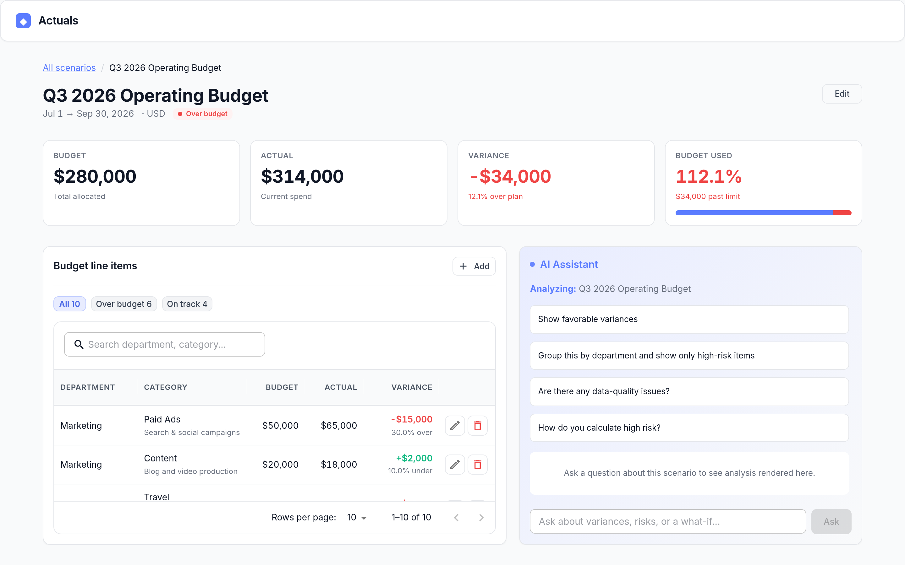

# Actuals

**Budget variance analysis with an AI analyst.**

[](https://github.com/amirhosseinsaloot/actuals/actions/workflows/ci.yml)

A workspace where a finance reviewer manages budget scenarios and line items,
then asks an AI assistant to analyze them. The assistant streams results over
SSE and renders them as interactive widgets (variance tables, risk lists,
simulations, charts).



**Guiding principle:** the LLM is an *analyst interface, not the calculation
engine*. All budget math runs in deterministic Django services. The agent only
picks one of five typed, approved tools — the **validated tool output**, never
model-generated JSON, is what reaches the UI.

## Under the hood

A Django 5.1 and DRF backend runs on ASGI/uvicorn, against PostgreSQL 16 in
Docker and a SQLite file locally. The assistant is built on the OpenAI Agents
SDK, and its output reaches the browser over server-sent events — one-way,
server to client, carrying status, text and validated results as each tool
finishes. The interface is Next.js 14 on the App Router, with React 18,
TypeScript and MUI 6.

For the reasoning behind the layering, see [architecture](docs/architecture.md).
The [HTTP API](docs/api.md) covers endpoints and result envelopes, and
[metric definitions](docs/methodology.md) covers how variance, severity and
scenario health are calculated.

## Run

### Locally, without containers

The backend falls back to a SQLite file when `DATABASE_URL` is unset, so nothing
needs to be installed or started beyond the two dev servers.

```bash
# backend  →  http://localhost:8000/api/
cd backend
python -m venv .venv && source .venv/bin/activate
pip install -r requirements.txt
python manage.py migrate
python manage.py seed_budget
uvicorn config.asgi:application --port 8000
```

```bash
# frontend  →  http://localhost:3000
cd frontend
npm ci
npm run dev
```

### With Docker Compose

Compose sets `DATABASE_URL` to the Postgres service, so this path runs the same
code against the target database. The backend migrates and seeds on startup.

```bash
cp .env.example .env
docker compose up --build
```

| Service | URL |
|---|---|
| Frontend | http://localhost:3000 |
| Backend API | http://localhost:8000/api/ |

The assistant needs `OPENAI_API_KEY`; without it, scenario and line-item
management still work and the assistant reports that it isn't configured.
Env vars are documented in [.env.example](.env.example).

## Test

Both suites run on the host rather than in a container, and need no database
server, no running services, and no API key (AI/SSE tests mock the agent):

```bash
cd backend
pip install -r requirements-dev.txt
pytest                    # add --cov for the coverage report
```

```bash
cd frontend
npm ci
npm test                  # or `npm run check` for lint + types + format + tests
```

The backend suite uses an in-memory SQLite database by default; export a
`DATABASE_URL` pointing at Postgres to run the same suite against the target
database. CI runs both on every push and pull request.

## License

MIT
